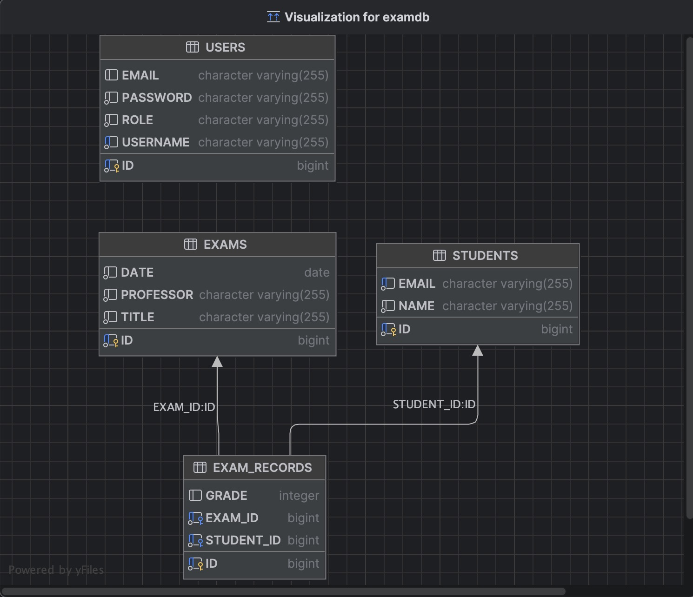
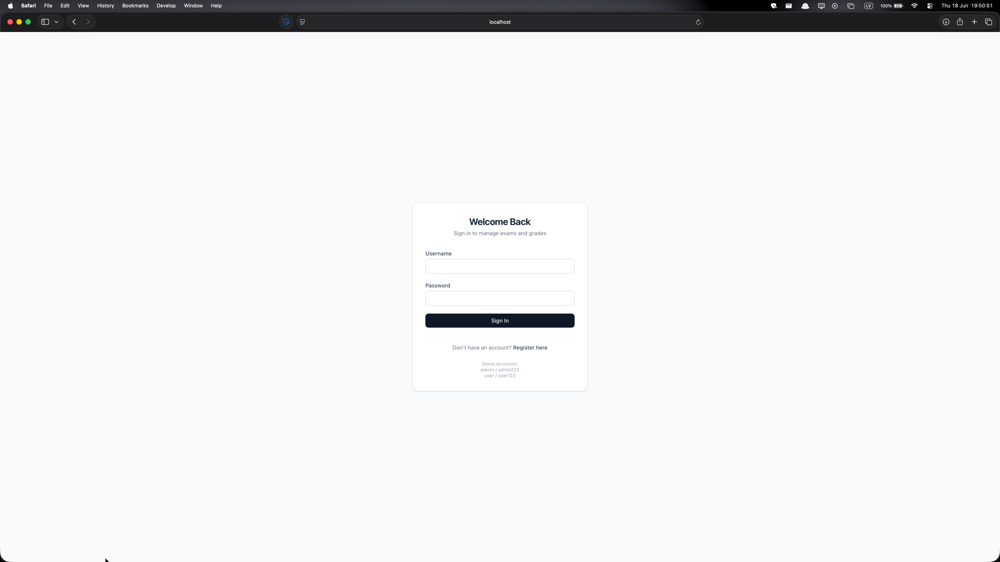
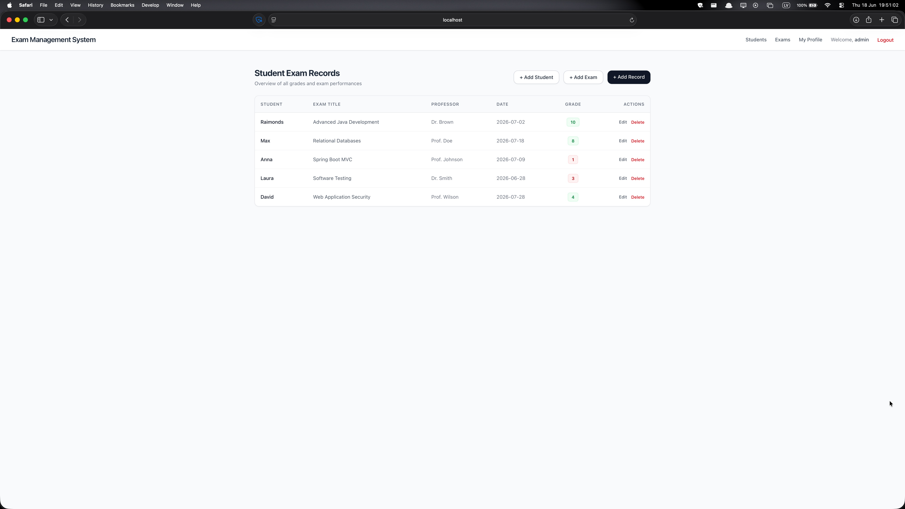
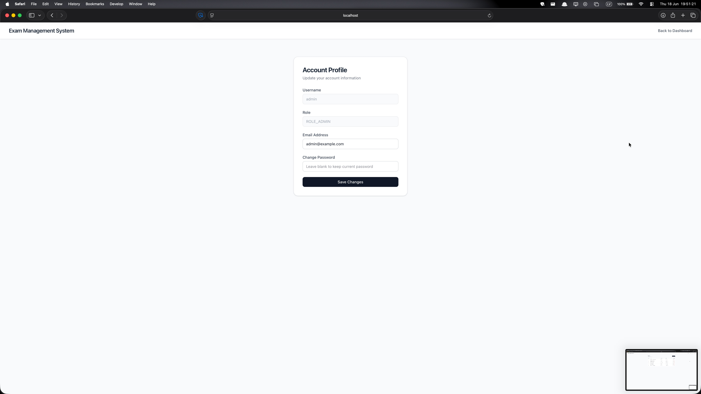
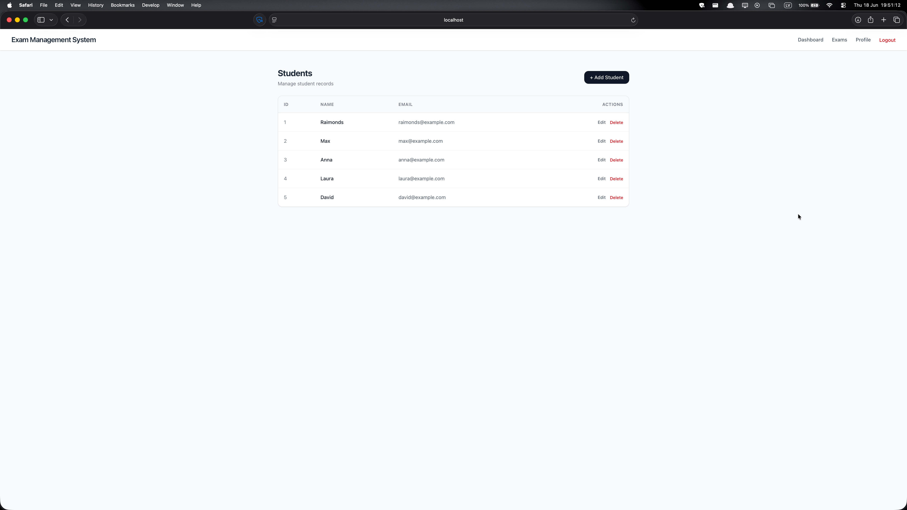
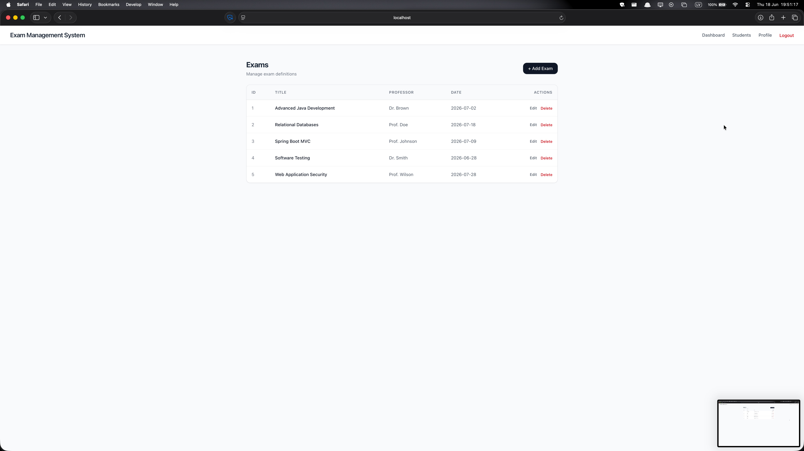

# Exam Management System

A Spring Boot MVC application for managing students, exams, and exam records.

## Features

- User registration and login
- Admin and user roles
- Student CRUD
- Exam CRUD
- Exam record CRUD
- Grade validation from 1 to 10
- H2 database with dummy data on startup
- Thymeleaf UI
- REST API endpoints
- Spring Security authentication

## Tech Stack

- Java
- Spring Boot
- Spring MVC
- Spring Data JPA
- Spring Security
- Thymeleaf
- H2 Database
- Maven
- Lombok

## Demo Accounts

admin / admin123  
user / user123

## Screenshots









## How to Run

Clone the repository:

```bash
git clone https://github.com/rsilinevich/exam-management-system.git
cd exam-management-system
```

Run the application:

```bash
mvn spring-boot:run
```

Then open your browser to:

```
http://localhost:8080
```

## H2 Console

The H2 console is available at:

```
http://localhost:8080/h2-console
```

Default settings:

```
JDBC URL: jdbc:h2:mem:examdb
Username: sa
Password: 
```

## REST API Endpoints

```
GET    /api/students
GET    /api/students/{id}
POST   /api/students
PUT    /api/students/{id}
DELETE /api/students/{id}

GET    /api/exams
GET    /api/exams/{id}
POST   /api/exams
PUT    /api/exams/{id}
DELETE /api/exams/{id}

GET    /api/exam-records
GET    /api/exam-records/{id}
POST   /api/exam-records
PUT    /api/exam-records/{id}
DELETE /api/exam-records/{id}
```